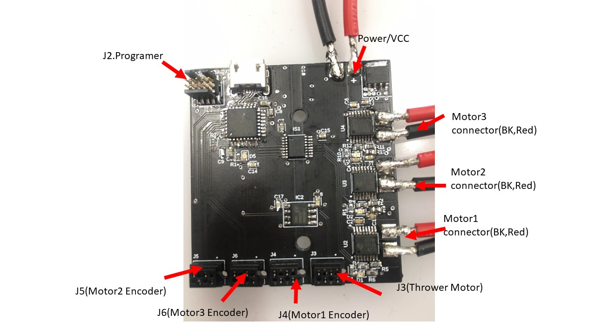

# pwir2020_Madmax_Electronics-
## Functionality Discription  
This electronic board consists of the main control circuit and driver circuit.  
  
This circuit capable of driver three DC Gear Motors (16V)  
  
and communicate with the onboard computer via USB connection execute Motor rotation is given speed and give feedback of speed.  
  
Another functionality of this board is controlling thrower servo Motor speed.  
  
Driver Motor speed control using PI controller implement in firmware to archive desired speed quickly  
## Communication  
Communication between the main PC and control board happens in HEX values(16 bits).  
driver Motor speeds send between 0-100, thrower Motors speed (0-1000) and end command  
  
Motor1_speed,Motor2_speed,Motor3_speed,Thrower_speed,command_end  
  
E.g. 64 00 64 00 64 00 64 00 AA AA  
  
## Connection ##  
- Micro USB: Communicate with PC where you can get speeds of the speeds of the motors and send feedback
- J7         : STM32 programmer connector  
	- 1 : +3.3V
	- 2 :SWDIO(communication with programmer)
	- 4 :SWCLK(Progrmamer clock)    
	- 10:NRST(reset)
	-  3,5,9:GND
	- 6,7,8: NC

- J5         : Driver Motor2 encoder conector
	- 1 : GND	    
	- 2 :+3.3V
	- 3 : Encoder Signal line 2 for Motor2
	- 4 : Encoder Signal line 1 for Motor2
             
- J6         : Driver Motor3 encoder conector
	- 1 : GND
	- 2 :+3.3V
	- 3 : Encoder Signal line 2 for Motor3
	- 4 : Encoder Signal line 1 for Motor3)
- J4         : Driver Motor1 encoder conector  
	- 1 : GND
	- 2 :+3.3V 
	- 3 : Encoder Signal line 2 for Motor1
	- 4 : Encoder Signal line 1 for Motor1
- J3         : Thrower Motor Signal connector
	-  1 : GND
	-  2  :PWM
	-  3 : NC 
	-  4 : NC
- U2         : Driver Motor1 power connector
- U3         : Driver Motor2 power connector
- U4         : Driver Motor3 power connector
- '+'          : Driver Motor powerconnection (battery 16V)
- '+'          : Driver Motor powerconnection (battery 16V)

   
